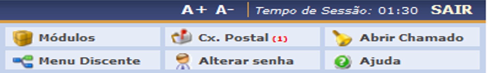
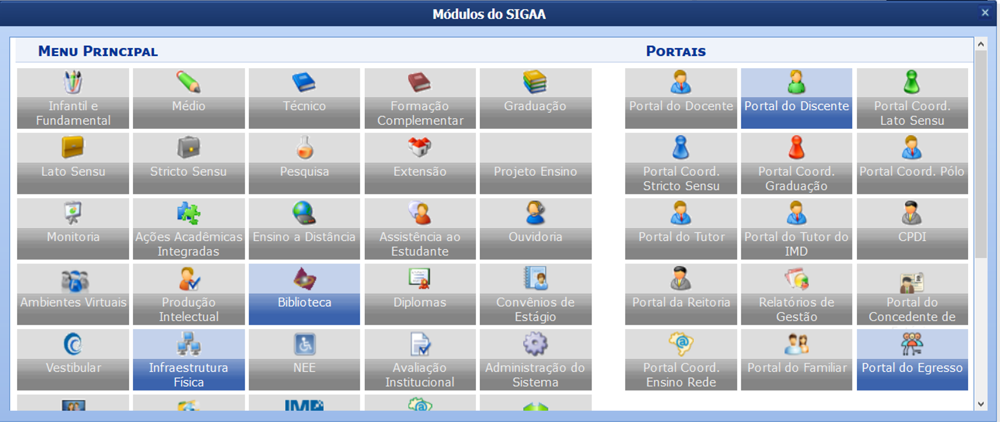
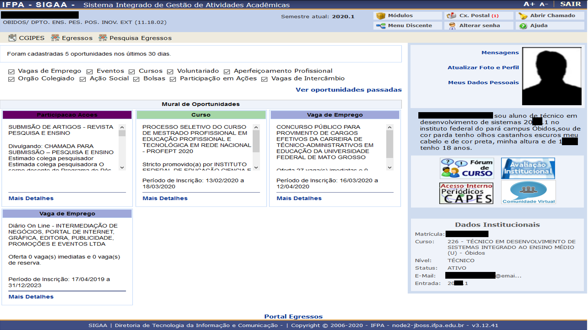

4. Módulos
==========
.. contents::
  :local:

Os módulos no SIGAA podem ser acessados pelo 'Menu de acesso a aplicações'. Cada tipo de grupo de acesso possui mais ou menos módulos disponibilizados. Nesta seção apresentaremos aqueles oferecidos aos discentes.

Para visualizar os módulos que você tem acesso basta acionar a operação 'Módulos' no 'Menu de acesso a aplicações'.

   
   Visualizando os módulos disponíveis em sua conta.

Ao accionar a operação 'Módulos', como estudante você perceberá que possui somente algumas aplicações disponíveis além do 'Portal Discente' (também acessível pelo 'Menu de acesso a aplicações' pela operação 'Menu Discente') já apresentado em detalhes, reveja o mesmo em |location_link|.

.. |location_link| raw:: html

   <a href="sigaa.html#portal-discente">1.2. Portal Discente</a>

   
   Visualizando os módulos disponíveis em sua conta.

4.1. Portal do Egresso
^^^^^^^^^^^^^^^^^^^^^^

O 'Portal do Egresso' é um espaço de interação, onde o estudante pode obter acesso e conhecimento das ações estimuladas pelo IFPA, bem como editais que possibilitarão a entrada em diversas campanhas de melhoria na formação discente, vagas de emprego, novos cursos e demais informativos. Portanto, acessar este espaço periodicamente é de suma importância.

   
   Visualizando o 'Portal do Egresso'.