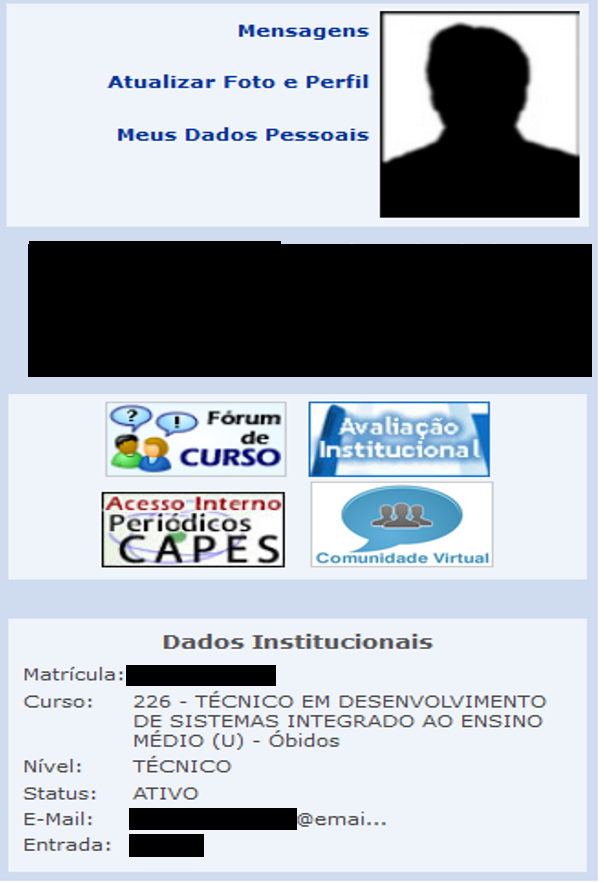
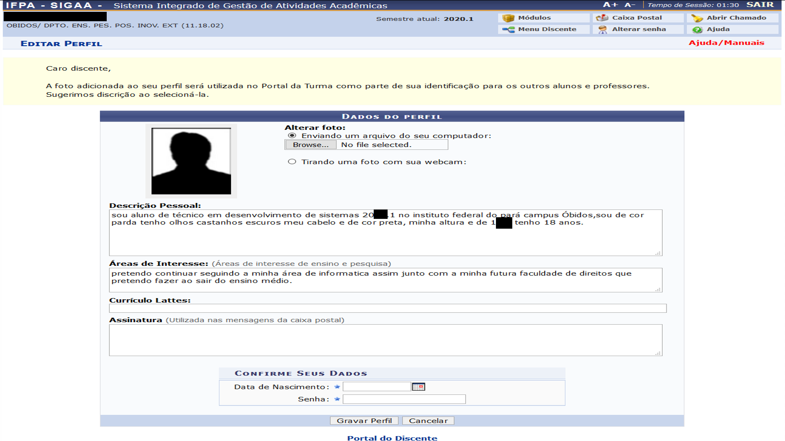
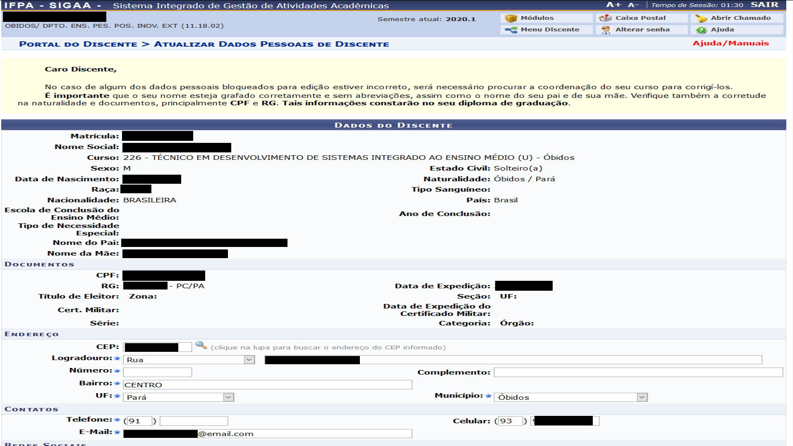
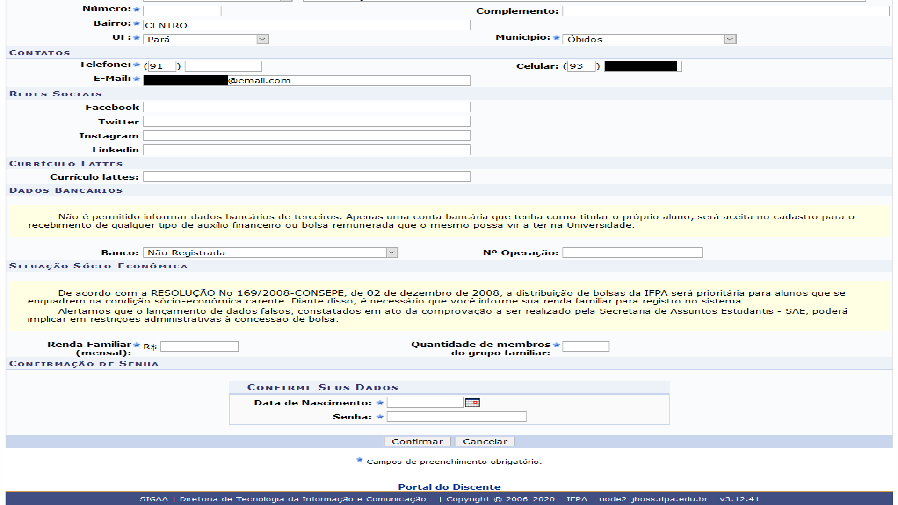

7. Perfil - Dados Institucionais
================================
.. contents::
  :local:

Para alterar dados do perfil, retorne ao 'Portal Discente'.

Seu perfil é apresentado de maneira resumida do lado direito do portal. É apresentada uma foto, ao lado da mesma existem links de acesso rápido, 'Mensagens' irá redirecionar você a sua 'Caixa Postal'.

.. note::
    Recomendamos fortemente que você inclua uma foto sua. Isso ajudará a equipe do IFPA e seus colegas a identifica-lo. 

Os dados institucionais apresentados neste painel são resumidos, mas apresentam seu curso, semestre de entrada e situação cadastral.

   
   Painel de perfil do usuário do 'Portal Discente'.

7.1. Atualizar Foto e Perfil
^^^^^^^^^^^^^^^^^^^^^^^^^^^^

Ao clicar no link 'Atualizar Foto e Perfil', você poderá adequar a mensagem da 'Descrição pessoal' e enviar/tirar uma foto para colocar em seu perfil. Após estas ações basta clicar em 'Gravar Perfil'. Para gravar, o sistema exige a confirmação de dados, sendo sua 'Data de Nascimento' e 'Senha'. 

   
   Atualização do perfil.

7.2. Meus dados Pessoais
^^^^^^^^^^^^^^^^^^^^^^^^

No painel do seu perfil, ao clicar em 'Meus Dados Pessoais' você poderá completar/atualizar seu cadastro. Perceba que somente alguns campos podem ser modificados. Sempre mantenha sua conta atual, com endereço, telefone e e-mails em ordem. Essas informações são importantes para contata-los.

   
   Atualização dos dados Pessoais.

Para os 'Dados Bancários' e 'Situação Sócio-Econômica' leia com atenção os avisos. Essas informações podem ser pedidas pela instituição em algum momento, caso já possua as mesmas, informe.

   
   Atualização de 'Dados Bancários' e 'Situação Sócio-Econômica'.

Igualmente a atualização de perfil, para gravar, o sistema exige a confirmação de dados, sendo sua 'Data de Nascimento' e 'Senha'.