8. Turma virtual
================
.. contents::
  :local:

Para entrar em uma sala virtual é simples. Ao realizar login, as suas disciplinas terão uma sala virtual individual cada, sendo listadas no 'Painel Discente' na área 'Turmas do Semestre'. Quando as disciplinas são frechadas pelos professores elas deixam de fazer parte desta lista no semestre subsequente, sendo arquivadas.

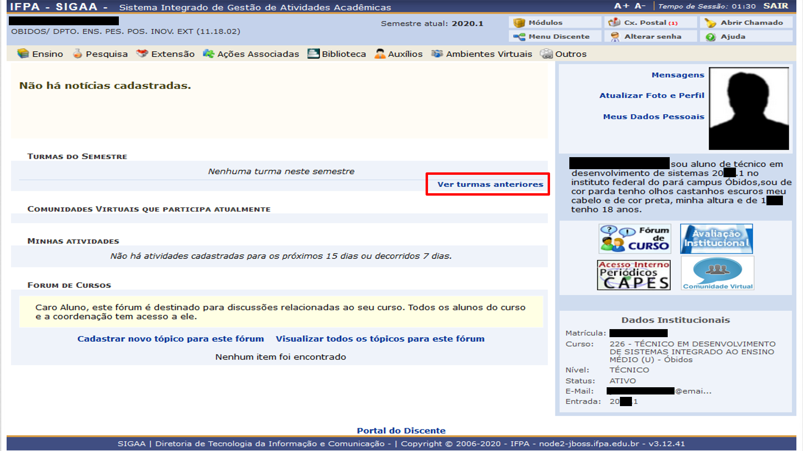

    Identificação da área 'Turmas do Semestre' no 'Portal Discente'.

Para acessar as turmas virtuais arquivadas, na área 'Turmas do Semestre' clique no link 'Ver turmas anteriores'.

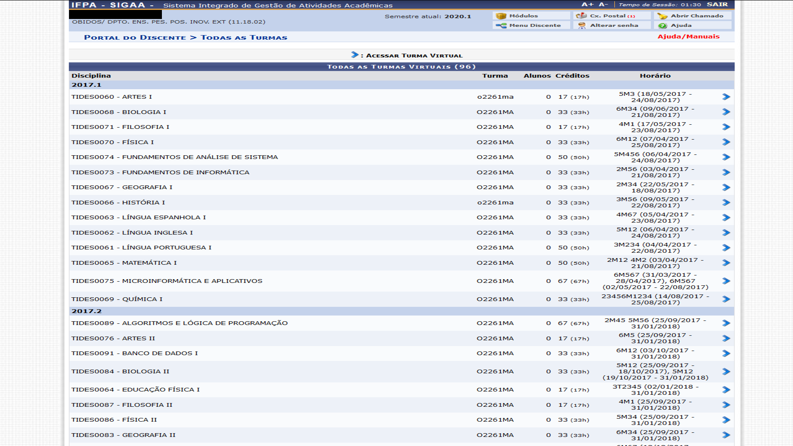

    Identificação da área 'Turmas do Semestre' no 'Portal Discente'.

.. note::
    A página de 'Turmas Virtuais' contém todas as turmas virtuais que você já cursou. Mantendo materiais, atividades e dados históricos.

8.1. Interface
^^^^^^^^^^^^^^

.. figure:: _media/img_32.png
    :alt: Recursos da 'Turma virtual'.

    Recursos dentro da 'Turma Virtual'.

Nesta interface você nota os seguintes recursos/indicadores:

#. Identificação: Seu nome de estudante, unidade a qual está vinculado, semestre atual, código do diário seguido do nome do componente curricular e semestre ao qual você estudou/estuda e código da turma.

#. Atalhos: Ao clicar no ícone da 'Casa' você será redirecionado ao 'Portal Discente', o ícone da 'Impressora' imprime o conteúdo visível na viewport (Janela de visão) e o 'Setas circulares' atualiza a página e o conteúdo da viewport. O botão 'Trocar de Turma' o auxilia na troca entre turmas virtuais diferentes. Por sua vez, o ícone 'Cog' contém configurações que você pode fazer em sua conta.

#. Painéis de informação: Estes painéis agrupam informações importantes para sua orientação na disciplina, como 'Notícias' que são informes e avisos 'Enquete' que pode ser uma atividade ou levantamento do professor a ser respondido por você. 'Atividades' é um dos mais importantes entre os painéis, pois organiza tudo que esta para ser realizado na disciplina. 'Avaliações' apresenta as datas, hora e locais de provas e 'Mensagens do Fóruns' o atualiza dos tópicos mais atuais.

#. Viewport ou Janela de Visão: É aqui que são apresentados ou renderizados os recurso e informações de acordo com, sua navegação pelo 'Menu Turma Virtual'. Atualmente, você está vendo a vista 'Principal'.

.. note::
	Focaremos apenas nos recursos importantes e de uso notório.

8.1.1. Manipuladores
--------------------

Geralmente serão apresentados o seguintes manipuladores nas diversas janelas e recursos:

#. Visualizar (ícone 'Lupa'): Para ler algum recurso/documento/dado;

#. Alterar (ícone 'Lápis'): Para modificar/atualizar um recurso/documento/dado;

#. Remover (ícone 'Lixeira'): Para deletar/remover um recurso/documento/dado.

.. figure:: _media/img_52.png
    :alt: Manipuladores gerais da 'Turma virtual'.

    Manipuladores gerais da 'Turma Virtual'.

8.2. Menu Turma Virtual
^^^^^^^^^^^^^^^^^^^^^^^

Para navegar no ambiente da sua turma virtual você utilizará o 'Menu Turma Virtual' para assim acessar os diversos recursos de sua disciplina, cada sala tem este menu, ao clicar em um dos seus itens, o resultado de cada operação será apresentado, na maioria das vezes na 'Viewport'.

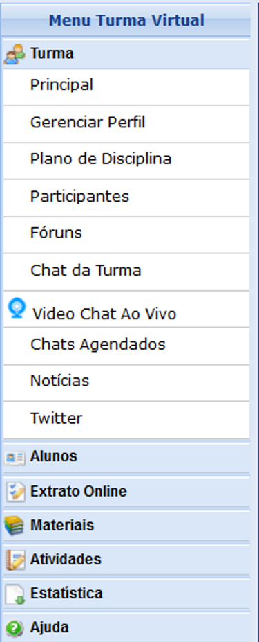

    Menu principal da 'Turma Virtual'.

8.2.1. Principal
----------------

Quando entramos na Sala Virtual somos redirecionados a tela 'Principal', acessível pela opção 'Principal' do 'Menu Turma Virtual'. Contém de forma cronológica os conteúdos e materiais inseridos pelo professor ao longo do curso como você pode notar na figura da seção |link_imagem5|.

.. |link_imagem5| raw:: html

   <a href="#id5">8.1. Interface</a>

.. note::
    Todos os recursos podem aparecer na sua página 'Principal'. O que as outras operações fornecem de forma geral são filtros para o emaranhado de tecnologias que temos na turma virtual.

8.2.2. Plano da disciplina
--------------------------

O plano da disciplina fornece ao estudante um vão completa do que o mesmo irá estudar, os conteúdos, dias das aulas, datas das avaliações, referências e livros utilizados pelo professor, ou seja, o planejamento que foi desenvolvido para ser executado em sala de aula.

.. figure:: _media/img_34.png
    :alt: Plano da disciplina da 'Turma virtual'.

    Visualização do 'Plano da Disciplina' da 'Turma Virtual'.

8.2.3. Participantes
--------------------

Nesta janela você tem acesso a todos integrantes da turma virtual, assim, professor e alunos podem ter acesso ao nome, e-mail para contato e curso ao qual outro estudante faz parte. Este recurso foi desenvolvido para facilitar a interação entre alunos e trabalhos em grupo.

.. note::

	Por este motivo, reforçamos para que você insira uma foto em seu perfil.

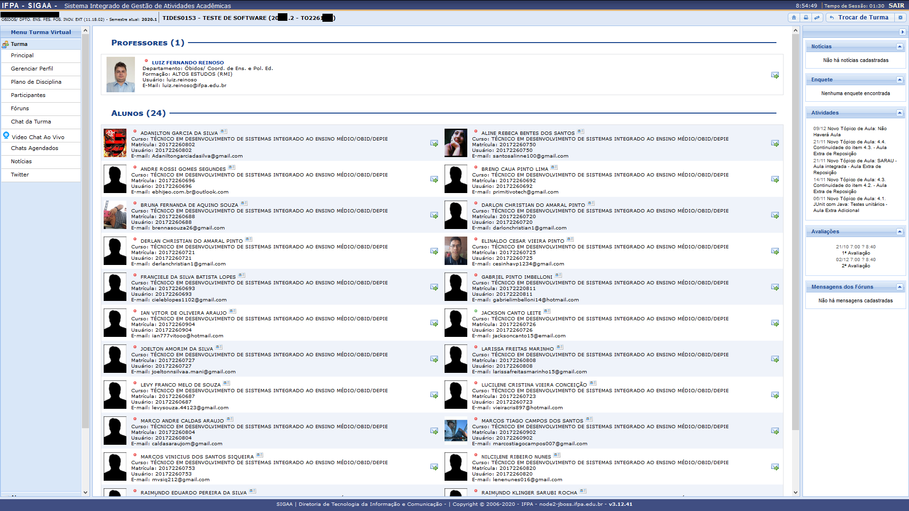

    Visualização dos 'Participantes' da 'Turma Virtual'.

8.2.4. Fóruns
-------------

Os fóruns são espaços de debate e discussão assíncrona, onde tópicos relativos a sua disciplina são abertos, possibilitando interação da turma.

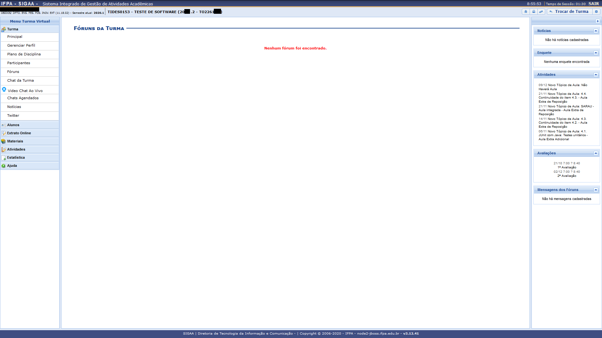

    'Fóruns' da 'Turma Virtual'.

8.2.5. Chat da Turma
--------------------

Durante as aulas ou mesmo no espaço da escola, comumente os estudantes estão dispersos, o 'Chat da Turma' possibilita que todos os participantes da turma virtual interajam em tempo real, podendo trocar ideias e interagir na disciplina.

.. note::
	Recurso recomendado para que durante as aulas de laboratório ou aquelas que exijam interação entre os alunos, os estudantes possam conversar sem transitar e/ou conversar em sala.

.. figure:: _media/img_37.png
    :alt: Chat da 'Turma virtual'.

    'Chat' da 'Turma Virtual'.

8.2.6. Video Chat Ao Vivo
-------------------------

.. todo::
  *Instrumento em fase de implantação. Ainda fora de uso.*

Este recurso é similar ao chat apresentado anteriormente, porém, o intuito é utilizar áudio e vídeo durante as interações.

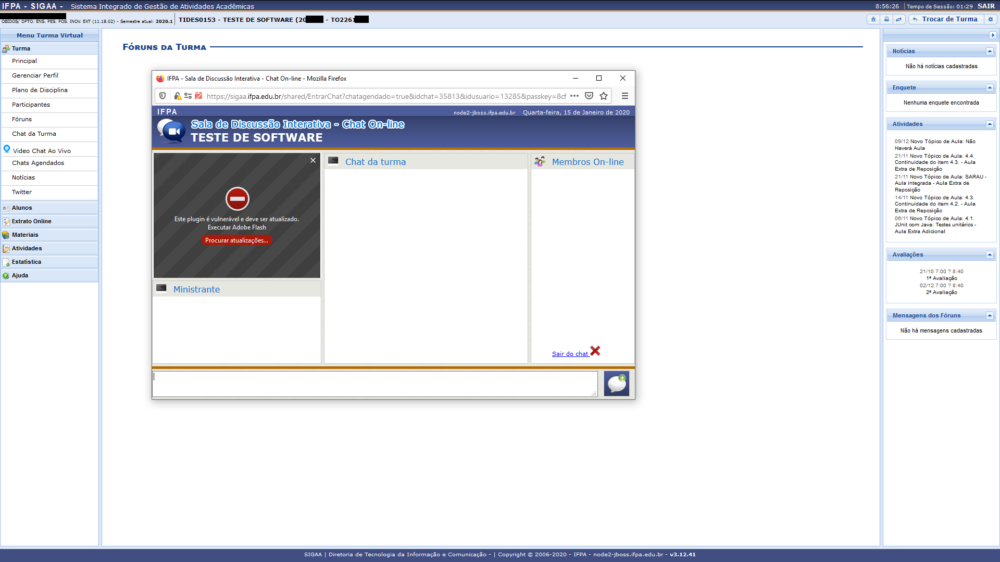

    'Video Chat Ao Vivo' da 'Turma Virtual'.

8.2.7. Chats Agendados
----------------------

Este recurso é simples, seu professor pode marcar chats, aqui você tem a listagem destas datas.

8.2.8. Notícias
---------------

O professor da turma pode cadastrar noticias, as mesmas podem aparecer na vista 'Principal' quando cadastradas. Todas as notícias são listadas nesta janela.

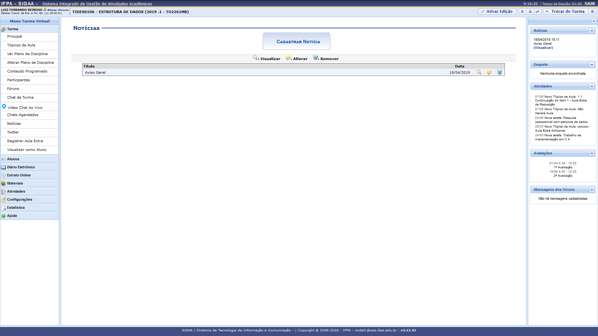

    'Notícias' da 'Turma Virtual'.

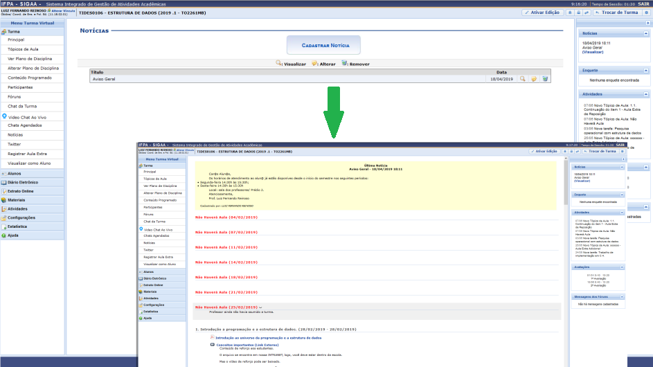

    'Notícias' na 'Principal' da 'Turma Virtual'.

8.2.9. Twitter
--------------

Com vistas ao uso das redes sociais para dar maio suporte a educação, seu professor poderá se desejar e julgar necessário utilizar o Twitter para amparo as aulas.

.. figure:: _media/img_41.png
    :alt: 'Twitter' da 'Turma virtual'.

    'Twitter' da 'Turma virtual'.

8.3. Menu Alunos
^^^^^^^^^^^^^^^^^

No menu 'Alunos' você tem operações relativas ao seu cadastro na turma, como frequências, notas e grupos de trabalho ao qual pertence.

.. figure:: _media/img_53.png
    :alt: Menu 'Alunos' da 'Turma virtual'.

    Menu 'Alunos da 'Turma virtual'.

8.3.1. Frequência
------------------

Nesta janela você pode acompanhar suas frequências e faltas.

.. figure:: _media/img_42.png
    :alt: 'Frequência' da 'Turma virtual'.

    'Frequência' da 'Turma virtual'.

8.3.2. Ver Grupo
-----------------

Cotidianamente seu professor pode criar grupos de trabalho para as diversas tarefas e atividades dentro de sua turma virtual.

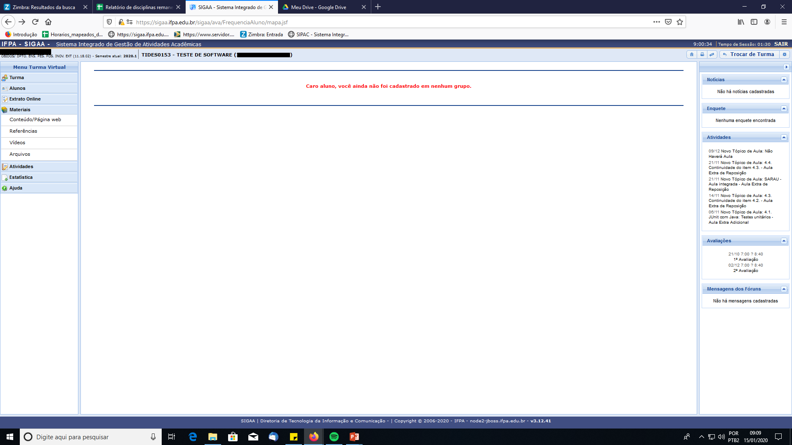

    'Ver Grupo' da 'Turma virtual'.

8.3.3. Ver Notas
-----------------

Para visualizar suas notas, basta acessar a operação 'Ver Notas' do Menu 'Alunos'.

.. figure:: _media/img_43.png
    :alt: 'Ver Notas' da 'Turma virtual'.

    'Ver Notas' da 'Turma virtual'.

8.4. Menu Materiais
^^^^^^^^^^^^^^^^^^^^

No menu 'Materiais' você tem acesso às diversas referências e materiais disponibilizados por seu professor.

8.4.1. Conteúdo/Página web
---------------------------

São links para recursos externos e páginas da internet que podem complementar seu conhecimento na disciplina.

8.4.2. Referências
-------------------

São as biografias básicas e complementares utilizadas por seu professor. Ter acesso a este referencial é necessário para que você vasculhe de forma melhor orientada suas buscas pela internet e na biblioteca.

.. figure:: _media/img_45.png
    :alt: 'Referências' da 'Turma virtual'.

    'Referências' da 'Turma virtual'.

8.4.3. Vídeos
--------------

São seleções de vídeos/filmes disponibilizados para aprofundamento na disciplina.

8.4.4. Arquivos
----------------

Arquivos e documentos disponibilizados pelo professor para estudo e aprofundamento na disciplina.

.. figure:: _media/img_46.png
    :alt: 'Arquivos' da 'Turma virtual'.

    'Arquivos' da 'Turma virtual'.

8.5. Menu Atividades
^^^^^^^^^^^^^^^^^^^^^

Durante seu tempo na turma virtual para uma disciplina, o professor pode passar diversos tipos de atividades além das avaliações, como pesquisas, enquetes, fóruns, chats, questionários, tarefas e muitas outras formas avaliativas.

Pensando na organização deste tipo de demanda o SIGAA conta com um menu 'Atividades' com disponibilização de diversas atividades para seu acompanhamento.

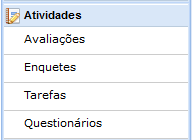

    'Menu Atividades' da 'Turma virtual'.

8.5.1. Avaliações
------------------

A janela de avaliações é consultiva, onde apresenta as datas, hora e local de provas.

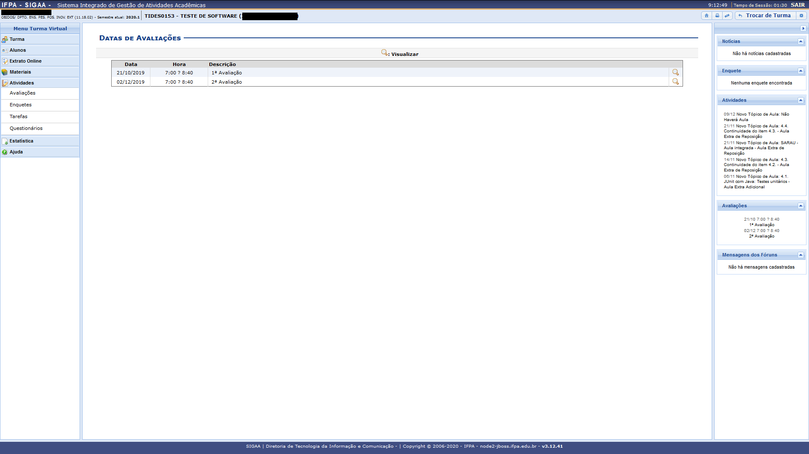

    'Avaliações' da 'Turma virtual'.

8.5.2. Enquetes
----------------

De forma simplificada são levantamentos realizados pelo seu professor.

8.5.3. Tarefas
---------------

Tarefas são atividades online ou off-line que seu professor poderá cobrar durante seu tempo na turma virtual, podem ser avaliativas ou não. Você poderá enviar resposta para tarefas dentro da mesma ou enviando arquivo a ser anexado a atividade, tudo depende das configurações impostas pelo professor, bem como data de abertura e fechamento da atividade. 

.. note::
    O estudante que não realizar Tarefas avaliativas sem justificativa válida poderá ficar sem nota.

.. figure:: _media/img_49.png
    :alt: 'Tarefas' da 'Turma virtual'.

    'Tarefas' da 'Turma virtual'.

.. note::
    As tarefas aqui estão filtradas em ordem cronológica. As mesmas se encontram distribuídas na vista 'Principal'.

8.5.4. Questionários
---------------------

São formulários com diversas questões, misturando tanto discursivas quanto alternativas, bem como múltipla escolha. O professor pode configurar o formato dos questionários o quanto julgar necessário, fornecendo nota avaliativa ou não, ate mesmo colocando tempo para realização deste tipo de tarefa e data de abertura e fechamento da atividade. 

.. note::
    O estudante que não realizar Questionários Avaliativos sem justificativa válida poderá ficar sem nota. 

.. figure:: _media/img_50.png
    :alt: 'Questionários' da 'Turma virtual'.

    'Questionários' da 'Turma virtual'.

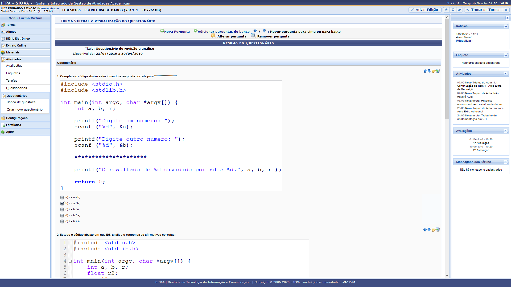

    Visualização de um Questionário em uma 'Turma virtual'.

8.6. Configurações
^^^^^^^^^^^^^^^^^^^

Fornece algumas possibilidades de configuração ao estudante.

8.7. Estatística
^^^^^^^^^^^^^^^^^

Fornecem dados estatísticos da turma e do estudante acerca de seu desempenho na turma virtual.

8.8. Ajuda
^^^^^^^^^^^

.. todo::
  *Instrumento em fase de implantação. Ainda fora de uso.*